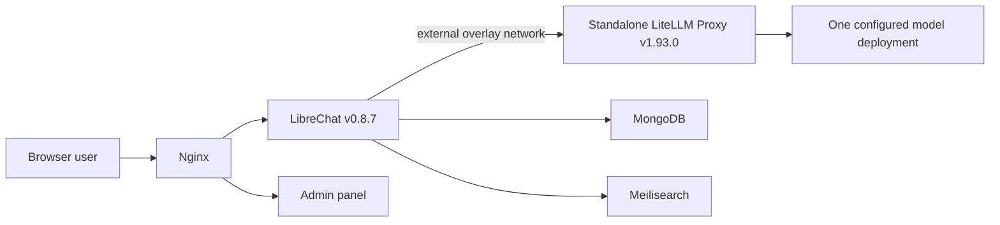

# Intersoft Chat — MVP architecture and evolution

## Current slice

LiteLLM is a service boundary, not a library baked into the LibreChat image.
LibreChat knows only the logical model name `default-chat`. Provider names,
deployment URLs, and credentials remain behind the gateway.

The gateway runs from the sibling `LLMGateway` repository. LibreChat joins its
attachable external Docker network as a client and resolves the stable
`llm-gateway` DNS alias.

Nginx is the only host-facing web service. The chat and admin containers have
no published host ports. For the local MVP, Nginx binds only to `127.0.0.1`;
TLS and public DNS are intentionally deferred.

## Routing decision

The MVP deliberately separates two meanings of routing:

- **Operational routing**: retries, cooldowns, fallback, and load distribution
  among deployments representing the same logical model. LiteLLM owns this.
- **Semantic/business routing**: selecting a cheap, standard, or reasoning
  model based on role, prompt content, risk, or price. This is deferred.

The initial pool contains one deployment. A second deployment can later be
added as another `model_list` entry with the same `model_name` without changing
LibreChat.

## Windmill compatibility rule

MVP does not require Windmill integration, but it preserves this future split:

- user interaction and conversations live in LibreChat;
- model access and operational pool behavior live in LiteLLM;
- automations, long-running work, retries, schedules, and human approval steps
  live in Windmill flows;
- short transformations and integration logic should normally be Windmill
  scripts using Windmill resources for secrets;
- MCP is the preferred tool-facing protocol where an assistant needs a tool
  catalog;
- a custom always-on service is introduced only when a protocol requires a
  persistent endpoint, and should delegate durable work to Windmill.

## Planned slices

### Slice 1 — current

- local LibreChat users;
- one LiteLLM model alias;
- two static assistant profiles;
- chat and persistence smoke test.

### Slice 2 — documents

- select an embeddings deployment;
- enable RAG/file search;
- test PDF and CSV ingestion;
- evaluate Code Interpreter separately for XLS transformations.

### Slice 3 — first safe tool

- expose one read-only capability;
- prefer a Windmill flow/script behind a thin MCP tool;
- record actor, inputs, output, duration, and correlation ID;
- do not use a shared service identity for destructive actions.

### Slice 4 — identity

- connect AD directly through LDAP or use Authentik as an OIDC broker;
- map external groups to LibreChat roles;
- design on-behalf-of identity for MCP and Windmill;
- disable local registration.

### Slice 5 — pool expansion

- add multiple equivalent deployments under `default-chat`;
- enable shared Redis before running multiple LiteLLM replicas;
- verify cooldown, rate-limit fallback, and audit data;
- consider semantic routing only after operational behavior is stable.

## Custom image policy

Use the pinned upstream LibreChat image while all changes are configuration.
Build a custom image only when there is an identified source-code change that
cannot be expressed through `librechat.yaml`, environment variables, model
specs, agents, or supported extensions. Keep LiteLLM outside that image.
